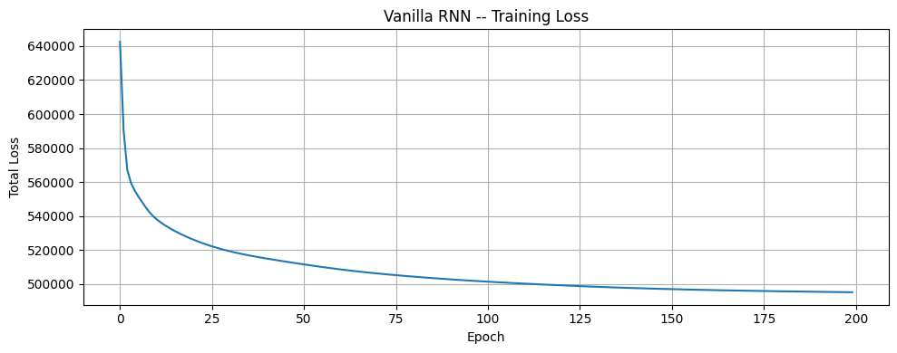
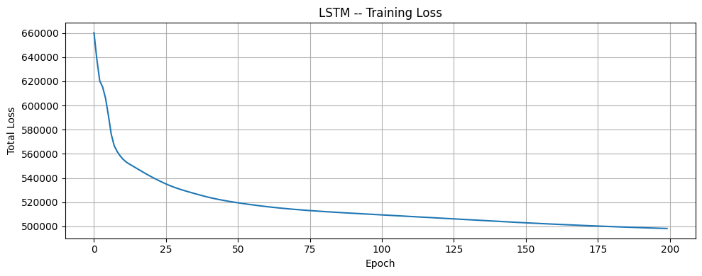

# RNN and LSTM from Scratch — Character-level Name Generation

Built this as part of my prep for a research internship. The goal was to really understand how RNNs and LSTMs work under the hood.

The task was simple: train a model on a list of names, and have it generate new name-like strings character by character.

---

## What's in here

- **Part 1** — Vanilla RNN trained on character sequences
- **Part 2** — LSTM (same task, better memory)

Both models are trained for 200 epochs on `names.txt` and then sampled to generate new names.

---

## Dataset

Just a `names.txt` file — one name per line (~32k names). I built a character-level vocabulary from it (a–z + a `.` token for start/end of word), so vocab size ends up being 27.

---

## Model Architecture

### Vanilla RNN

Pretty standard. At each step:

```
h_t = tanh(W_x · x_t  +  W_hh · h_{t-1}  +  b_h)
o_t = W_hy · h_t  +  b_y
```

Input is a one-hot vector of the current character, hidden state gets updated, output goes through softmax to pick the next character.

### LSTM

Same idea but with gating to control what gets remembered/forgotten:

```
f_t = σ(...)   ← forget gate
i_t = σ(...)   ← input gate  
o_t = σ(...)   ← output gate
c_t = f_t ⊙ c_{t-1}  +  i_t ⊙ c̃_t
h_t = o_t ⊙ tanh(c_t)
```

I initialised the forget gate bias to 1 (so the model remembers by default at the start of training) and everything else to 0.

---

## Training

| Thing | Value |
|-------|-------|
| Epochs | 200 |
| LR | 0.001 |
| Grad clipping | max_norm = 1.0 |
| Optimiser | Manual SGD (no torch.optim) |

Loss is cross-entropy over each character step, accumulated per word. Gradients zeroed per word, recurrent states detached between words.

---

## Loss Curves

### Vanilla RNN


Starts at ~640k, drops sharply in the first 25 epochs, then gradually flattens out to ~495k by epoch 200. Pretty classic — most of the learning happens early on.

### LSTM


Starts slightly higher (~660k) but converges to roughly the same place (~498k). The curve is smoother and the descent is more gradual compared to the RNN, which makes sense given the gating. Both models end up at a similar loss, though the LSTM takes a bit longer to settle.

---

## Bugs I ran into (and fixed)

Honestly spent way too long on this one — PyTorch has a subtle gotcha with leaf tensors:

```python
# This looks fine but is WRONG
# multiplying after requires_grad=True creates a non-leaf tensor
# so p.grad is always None and nothing learns
x = torch.randn(V, V, requires_grad=True) * 0.01

# Correct way — multiply first, THEN mark as leaf
x = (torch.randn(V, V) * 0.01).requires_grad_(True)
```

Also had to remember to detach both `h` and `c` between words (not just `h`), and add a None-guard on `.grad` before the update step.

---

## Requirements

```
torch
numpy
matplotlib
```

---

## How to run

1. Put `names.txt` in the root folder
2. Open the notebook and run all cells
3. Training loss prints every 10 epochs, generated names show up at the end of each part

---

## Repo structure

```
.
├── RNN_and_LSTM.ipynb
├── names.txt
├── rnn.png
├── lstm.png
└── README.md
```
